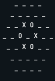
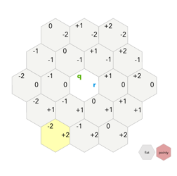
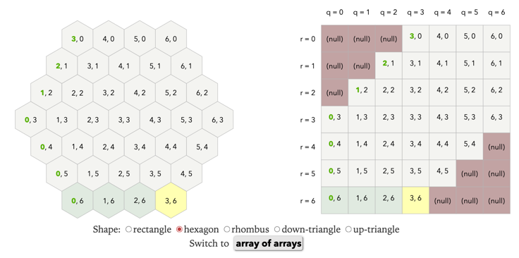

# model.ReversiModel
## Overview:
The following codebase is an implementation of the 2-player game, Reversi.
You can play the normal version of the game here: https://cardgames.io/reversi/ (scroll down on page to see rules).
Compared to the normal version, this implementation of the game (as depicted in model.ReversiModel)  
contains a hexagonal shaped board (flat-top shaped) instead of a square shaped board.
In addition, instead of square tiles, each tile will be hexagons (pointy-top). However,
since the view has not been fully-implemented, this version of the codebase will use a
textual implementation of the view, as shown below.

Due to the hexagonal shape compared to the square shape of the board in the standard
version of Reversi, a different coordinate system was chosen. The coordinate system chosen in this
implementation is the axial coordinate system. You can learn about axial coordinates in more depth here:
https://www.redblobgames.com/grids/hexagons/. The picture below
shows how the axial coordinate work.

Since we are unable to use negative coordinates in Java, the following array representation was used
store the board. __

We decided to do a 2d array over an array of arraylist to store the board since the size of the board does not change
during the game (and arrays cannot change in size). This would allow for retrieval of a specific
hexagon using its q and r coordinates (this wouldn't work if we chose an array of arraylist). Using an array
of array also allows for more efficient replacement of an item at index q, r (it would be O(n) for an array of arraylist
compared to O(1) for an array of array). The issue with
using an array of array is that due to the hexagonal shape, there will be unpopulated spots in the
2D array. These unpopulated spots will be initialized as null and no methods will be able to modify
these null spots (invariant).

In the graphical view, the coordinate system changes. This is due to our logical coordinate system
(see the transformLogicalToPhysical method in ReversiPanel) where
(0, 0) represents the center of the Jframe. As a result, we have a method, translateAxialCoords, that
converts the coordinate system used in the model (where q and r are non-negative) to the coordinate system
where (0, 0) is the center (still following the axial coordinate system). All this involves is subtracting
q and r by the length of the board array list / 2.

In the game (which is a two-player game), player 1 is represented as the integer 1 and player 2 is
represented as the integer 2. Player 1 is the white color while player 2 is the black color. We chose
represent the players as integers in the case there were more than two players (which is possible with
the Reversi rules).

## Quick Start:

ReversiModel model = new ReversiModel(4);

ReversiGraphicsView rv1 = new ReversiGraphicsView(model);
ReversiFrame theirView = new ReversiFrame(new ModelAdapter(model));
IView rv2 = new ViewAdapter(theirView);

HumanPlayer player2 = new HumanPlayer(model);
MachinePlayer mach = new MachinePlayer(model, new StrategyAdapter(new CaptureMost()));

ReversiController c1 = new ReversiController(model, mach, rv1);
ReversiController c2 = new ReversiController(model, player2, rv2);

model.startGame();
rv1.render();
rv2.render();
model.init();

.
.
.

## Key Components
The code base follows the model, view, controller framework (controller not yet implemented).
The model contains all rules and the actions that can be done in Reversi. To use the view,
a copy of the model is passed into the view.

### Key Subcomponents
#### model
The model consists of a board, represented as a 2d array of model.Hexagon Objects, a turn counter, skip counter
and a HashMap of the colors corresponding to the players.

* A model.Hexagon object represents a single hex on the board, and has a model.DiscState field.

* The model.DiscState is an enum that can either be NONE, BLACK or WHITE

#### view
The Reversi Graphical view consists of components (ReversiPanel)

## Source Organization
Within the src directory, there are two packages, model, view, strategy, and commands.

1. model includes :

* model.DiscState.java : Enum model.DiscState used in the model.Hexagon object
* model.Hexagon.java : model.Hexagon object used in model
* model.ReadonlyIReversi.java : Interface for Reversi model where all methods are
* observation methods (used by view).
* model.IReversi: Extends model.ReadonlyIReversi. Contains all operations for Reversi game.
* model.ReversiModel.java : model Implementation
* model.ModelStatus : methods to notify model observer (controller), subject in observer pattern
*

2. view includes :

* IView.java : Interface for the view
* ReversiTextualView : Textual view Implementation
* ReversiGraphicalView : Graphical view implementation
* HexagonImage : model.Hexagon graphic used in graphical view.
* ReversiPanel : Reversi representation of a JPanel
* MockView : Mock of the view used for testing

3. controller includes :
* MockPlayerActions : controller/features mock for testing
* ModelObserver : interface for observing model
* ReversiController : controller for Reversi, implements model observer and player actions
* PlayerActions : features (feature pattern) or all actions a player in Reversi can do

4. player includes :
* HumanPlayer : class for human player (empty because view emits PlayerActions)
* IPlayer : interface for players
* MachinePlayer : class for AI/machine player, uses strategies to emit PlayerActions
* MockMachinePlayer : mock class for testing (changes delay to allow for testing)

5. adapters includes :
* ModelAdapter : converts IReversi (our model interface) into Reversi interface (provider's model interface)
* PlayerAdapter : two-way adapter between IPlayer (our player interface) and Player (provider player 
* interface)
* StrategyAdapter : converts Stratagy (provider's strategy interface) to Strategy (our strategy interface)
* ViewAdapter : converts ReversiFrame (provider's view concrete class) to IView (our view interface). Also 
* implements ControllerFeatures (provider's controller features class) in order to use with ReversiFrame. 

## Changes for part 2
We implemented the missing methods in the model that were
recommended to add:
* Method that checks if a player
  has any possible moves. If they don't, it throws an Exception
  telling the player to pass.
* Method for getting the score. Used in strategies
* Method to check the expected score of a move. Used in strategies
* Method to return a deep copy of the model for use in the expected score
  method
* Method to get the side length of the model to be able to calculate distance.
  We also followed the feedback given to us from
  the last assignment.

## View Tests
Start of game

Hex selected

Arbitrary point in game

## Keyboard Interactions
Pressing 'm' attempts to place a disc on the selected coordinates.
Pressing 'p' attempts to pass your turn.

## Extra Credit
The Extra Credit strategies are in the Strategies module, including:
* Simple highest score increase strategy
* Avoid Corners strategy
* Only use corners strategy,
* Modular strategy to combine the different strategies in the order specified by the user.

The mock test transcript is available in [the transcript](strategy-transcript.txt)

## Changes for part 3

We added the ModelObserver, PlayerActions, ModelStatus interfaces.

* ModelObserver sends notifications from the controller using the observer pattern
  * These include notifying the correct listener that it is their turn,
    notifying to update views, notifying that there is an error to be displayed
    , that there is a winner, or a draw and to stop the game.
* PlayerActions is the actions that the player can take and send to the controller
  * These are to pass and to move
* ModelStatus includes notifying that it is your turn, notifying to update the view
  and notifying that the game is over

We also added other functionality in the view. We added a JLabel that shows 
if the user has passed. 

## Controller
The controller takes in a model, a view and a player.

The controller connects the model, the view and the controller and sends
commands between them. All interactions between the parts are mediated by
the controller. These include all the player actions, such as passing
and moving, all the view interactions such as passing and moving, and
all the notifications from the model about the board state and game state.

## Player
The player is able to move and pass. In the case of the machine player,
a strategy is passed into the player, which determines the actions to be
taken. The human player ignores these methods and lets the view handle
the moving and passing. 

## Reversi Creator 
The ReversiCreator has the following options:
side-length, human-player, and machine-player.
The side-length parameter is optional (default is sidelength of 4) and is followed
by an integer representing the side length of the hexagon (e.g side-length 8)
After adding the side-length parameter (or not inputting the side-length parameter),
the next input is player 1. Player 1 can either be human-player or a machine-player.
To add a human player, type "human-player" followed by no other parameters.
To add a machine player, type "machine-player" followed by "strategy3", space, and/or "strategy2"
(e.g. machine-player strategy3 strategy2). By default, the machine-player has strategy1 installed
to make the strategy the machine-player uses a complete strategy (strategies 2 and 3 are incomplete).
You would also want the strategies to be in highest to lowest order since the higher the strategy, 
the better the strategy is (so you want to have that strategy be prioritized before using the lower strategy).
After choosing player1, you must choose player2 using the same format as player1 (e.g machine-player strategy2).
An example of running the game is "side-length 8 machine-player strategy3 strategy2 human".
Another example would be "human machine-player strategy3" (side-length is 4 in this case as default).

## Making Another View Work With our Model and Controller. 
We were able to fully implement our provider's view (including the features that our view did not have).
However, we had to add a lot of methods in the ReversiController class. All of these new methods are seen 
in the ExtraFeaures interface and are only needed for the additional features that we did not have in 
our view. We also modified some parts of our model to work with our provider's view (does not break any 
functionality with our view). One change was we changed the input of startGame. Before, startGame would take 
in a sideLength. However, we changed it so the constructor takes in a sideLength. This was because 
after our provider's view is constructed, it tries to get the board array length of the model. However,
in our old ReversiModel implementation, after the ReversiModel was constructed, it wouldn't have an array length (not untill
startGame was called). We also modified the interface for IReversi based on the request of the people 
we sent our code to. One of the methods, copyBoard, returned a ReversiModel. However, they didn't have 
access to ReversiModel. To fix this, we simply removed it from the interface and made copyBoard private 
since the only time it is called is by the checkMove method. 

